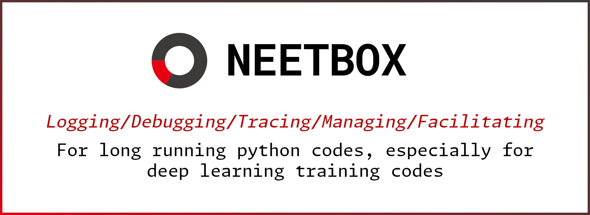

# NEETBOX

[](https://wakatime.com/badge/user/b93a26b6-8ea1-44ef-99ed-bcb6e2c732f1/project/8f99904d-dbb1-49e4-814d-8d18bf1e6d1c) [](https://github.com/visualDust/neetbox/actions/workflows/poetry-pytest.yml)  
  [](https://github.com/psf/black)




## docs & quick start

Logging/Debugging/Tracing/Managing/Facilitating your deep learning projects. A small part of the documentation at [neetbox.550w.host](https://neetbox.550w.host). (We are not ready for the doc yet)

## installation

```bash
pip install neetbox
```

## use neetbox in your project

in your project folder:
```
neet init
```
neetbox cli generates a config file for your project named `neetbox.toml`

in your code:
```python
import neetbox
```

## usage examples

[how to guides](todo) provides easy examples of basic neetbox funcionalities.

## Star History

[](https://star-history.com/#visualDust/neetbox&Date)
